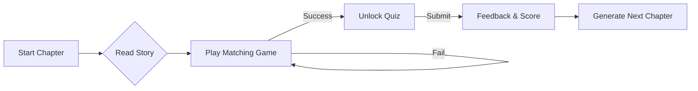

# 🌿 BioTales: The Story of Life 🧬

> **"Where mitochondria aren't just the powerhouse of the cell—they are the burning forges of the Citadel."**


**BioTales** is an interactive, AI-driven educational platform that transforms complex biological concepts into memorable, epic narratives. By using powerful metaphors, generated illustrations, and gamified reinforcement, we trick your brain into learning difficult science as if it were your favorite fantasy novel.

---

## 📖 Table of Contents

- [✨ Core Features](#-core-features)
- [🏗️ Architecture & Diagrams](#-architecture--diagrams)
- [🎮 The Learning Loop](#-the-learning-loop)
- [🛠️ Tech Stack](#-tech-stack)
- [🚀 Getting Started](#-getting-started)
- [🧩 Deep Dive: AI Integration](#-deep-dive-ai-integration)

---

## ✨ Core Features

| Feature | Description |
| :--- | :--- |
| **🎨 AI Illustration** | Every chapter comes with a unique, style-consistent image generated by **Gemini 2.5 Flash Image** to visualize the metaphor. |
| **📜 Narrative Engine** | Turns dry textbook facts into stories (e.g., The Immune System becomes a "Fortress under Siege"). |
| **🧠 Metaphor Matcher** | A built-in **Memory Card Game** that forces you to link the story elements (The Wall) to the science (Cell Membrane). |
| **📝 Knowledge Check** | An adaptive quiz that ensures you understand the core concepts before unlocking the next chapter. |
| **♾️ Infinite Curriculum** | Whether it's "Glycolysis" or "Neuroscience", the AI generates a custom curriculum on the fly. |

---

## 🏗️ Architecture & Diagrams

### 1. High-Level Data Flow 🌊
How a user's request turns into a learning experience.

```ascii
+------------------+       +-------------------+       +-----------------------+
|  User Selection  | ----> |   Story Engine    | ----> |   Google Gemini API   |
| (Topic: Immune)  |       | (Prompt Eng.)     |       | (Flash 2.5 + Image)   |
+------------------+       +-------------------+       +-----------+-----------+
                                                                   |
                                                                   v
+------------------+       +-------------------+       +-----------------------+
|  React UI Render | <---- |   JSON Response   | <---- |  Structured Output    |
| (Story + Game)   |       | (Chapter Data)    |       | (Narrative + Quiz)    |
+------------------+       +-------------------+       +-----------------------+
```

### 2. Component Hierarchy ⚛️
The React structure designed for modularity and state management.

```ascii
App.tsx
│
├── TopicSelector.tsx 🗂️ (Grid of topics + Search)
│
└── StoryReader.tsx 📖 (Main Learning Interface)
    │
    ├── Narrative Section (Text + Image)
    │
    ├── Scientific Context (Sidebar explanation)
    │
    ├── MatchingGame.tsx 🃏 (Interactive Mini-game)
    │
    └── Quiz Section ❓ (Validation & Unlock)
```

### 3. The "Gamified" State Machine 🕹️
The user cannot progress passively; they must engage.



---

## 🎮 The Learning Loop

The app is designed around a strict pedagogical loop to ensure retention.

<details>
<summary><strong>Phase 1: The Hook (Story)</strong> 🏰</summary>
<br>
We do not start with definitions. We start with a story. 
<br><br>
<em>"The invaders breached the outer wall, but the White Sentinels were ready..."</em>
<br><br>
This primes the brain for information by creating an emotional context.
</details>

<details>
<summary><strong>Phase 2: The Bridge (Metaphor Matcher)</strong> 🌉</summary>
<br>
This is where the magic happens. The user plays a card matching game.
<br><br>
<strong>Left Card:</strong> "The White Sentinels"<br>
<strong>Right Card:</strong> "White Blood Cells"
<br><br>
This actively rewires the brain to associate the abstract concept with the concrete character.
</details>

<details>
<summary><strong>Phase 3: The Anchor (Quiz)</strong> ⚓</summary>
<br>
Before moving on, we verify the knowledge with a traditional multiple-choice quiz to solidify the facts.
</details>

---

## 🛠️ Tech Stack

*   **Frontend**: React 19 (Hooks, Functional Components)
*   **Styling**: Tailwind CSS (Utility-first, Custom Font Configuration)
*   **Icons**: Lucide React
*   **AI SDK**: `@google/genai` (Official Google GenAI SDK)
*   **Font**: *Crimson Pro* (Serif for reading) & *Inter* (UI)

---

## 🚀 Getting Started

Follow these steps to run BioTales locally.

1.  **Clone the repository**
    ```bash
    git clone https://github.com/yourusername/biotales.git
    ```

2.  **Install Dependencies**
    *(No package.json is needed if using the ES Modules version in the HTML, otherwise:)*
    ```bash
    npm install
    ```

3.  **Set up API Key**
    The app requires a valid Google Gemini API Key injected via `process.env.API_KEY`.

4.  **Run the App**
    ```bash
    npm run start
    ```

---

## 🧩 Deep Dive: AI Integration

We utilize **Structured Output** (JSON Mode) to ensure the AI creates a perfect game every time.

<details>
<summary><strong>View the JSON Schema</strong> ⚙️</summary>

```typescript
const chapterSchema: Schema = {
  type: Type.OBJECT,
  properties: {
    title: { type: Type.STRING },
    narrative: { type: Type.STRING },
    scientificContext: { type: Type.STRING },
    // The "Secret Sauce" for the game:
    matchingPairs: {
        type: Type.ARRAY,
        items: {
            type: Type.OBJECT,
            properties: {
                storyTerm: { type: Type.STRING },
                scientificTerm: { type: Type.STRING }
            }
        }
    }
  }
};
```
</details>

---

Made with ❤️ and 🤖 by the BioTales Team.
